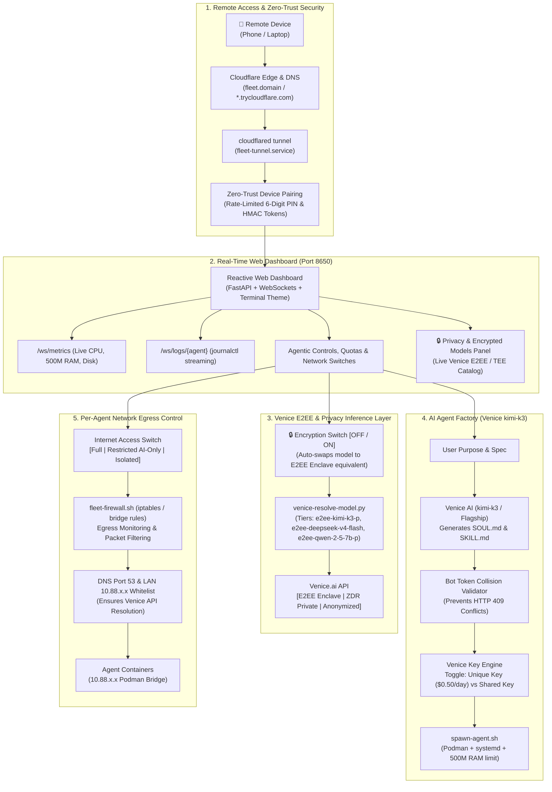

# Hermes Fleet Controller

Autonomous, multi-agent fleet controller orchestrating distributed **Hermes Agents** across virtual machines (VMware Workstation/Pro, VirtualBox, Proxmox, or Bare Metal Linux) with containerized execution via **Podman**, inference routing via **Venice AI**, remote management via **Cloudflare DNS & Tunnels**, real-time browser control via a **FastAPI Web Dashboard**, and messaging management via **Telegram**.

---

## Key Features

- **Real-Time Web Dashboard (Port 8650)**: Reactive browser-based terminal dashboard with live WebSocket feeds for CPU/RAM/Disk metrics, container status, and streaming `journalctl` logs.
- **Zero-Trust Device Pairing**: Cryptographically signed pairing engine with time-limited 6-digit PINs, IP rate-limiting, and HMAC-SHA256 session tokens for secure remote pairing from phones and laptops.
- **Cloudflare DNS & Tunnel Integration**: Outbound encrypted tunnel supporting instant Quick Tunnels (`*.trycloudflare.com`) or named custom domains without exposing public ports.
- **Venice E2EE Confidential Inference**: Direct integration with Venice's hardware-isolated confidential enclaves (Intel TDX / SEV-SNP). Includes a dedicated UI toggle to switch agents between standard inference and End-to-End Encrypted (E2EE) enclaves.
- **Venice Privacy Models Explorer**: Live catalog displaying all 12 E2EE hardware-enclave models and 56 Zero Data Retention (ZDR) models with token costs and one-click agent deployment.
- **Granular Per-Agent Network Firewall**: Dynamic iptables packet filtering allowing per-agent switches between **Full Internet**, **Restricted (AI & LAN only with DNS port 53 whitelist)**, and **Isolated (Air-Gapped)**.
- **Venice AI Agent Factory**: Frontier `kimi-k3` prompt-to-agent authoring that generates custom `SOUL.md` personas and `SKILL.md` workflows, sets `$0.50/day` default quotas, validates bot token collisions, and boots containers.
- **Autonomous Self-Improvement & GitHub PR Bot**: Weekly feedback analyzer that gathers top 50 error traces, opens GitHub issues, uses a dedicated **$1.00 Venice API key** to synthesize bug fixes, executes syntax checks (`py_compile`), passes zero-leak scans, and submits automated GitHub Pull Requests with a human-in-the-loop merge policy.
- **Easy Daily Swarm & MCP Reporting**: Daily 09:00 digest discovering all active Model Context Protocol (MCP) servers (Home Assistant, Trollbox, custom tools) with 15-second health probes and smart Telegram 4000-char message chunking.
- **500 MB Resource Governance**: Strict `--memory 500m` container ceilings, 500 MB backup vault quotas with automatic oldest-first rotation, 500 MB journal ceilings, and SQLite WAL truncation (`PRAGMA wal_checkpoint(TRUNCATE)`).

---

## Architecture Overview



---

## Directory Structure

```text
hermes-fleet-controller/
├── bin/                              # Operational management scripts
│   ├── fleet-dashboard.py            # FastAPI + WebSockets real-time control center (port 8650)
│   ├── fleet-pair.py / fleet-pair    # Zero-trust device pairing & HMAC token generator
│   ├── fleet-tunnel.sh               # Automated Cloudflare Tunnel runner
│   ├── fleet-firewall.sh             # Granular iptables per-agent egress controller
│   ├── fleet-factory.py              # Venice frontier prompt-to-agent synthesis engine
│   ├── fleet-report.py / fleet-report# Daily operations & MCP catalog digest with chunking
│   ├── fleet-self-improve.py         # Autonomous weekly feedback & GitHub PR generator ($1 key)
│   ├── fleet-rollback.sh             # 1-command emergency rollback to verified stable commit
│   ├── fleet-audit.sh                # Pre-flight system resource audit & swarm capacity sizing
│   ├── fleet-backup.sh               # Atomic SQLite VACUUM INTO & WAL checkpoint hot-backup
│   ├── fleet-restore.sh              # One-click disaster recovery & snapshot restoration
│   ├── fleet-publish-gh.sh           # Automated GitHub publisher with zero-leak verification
│   ├── fleet-attach-keys.sh          # Credential setup & validation wizard
│   ├── venice-manage-keys.py         # Sub-key generator & daily inference budget allocator
│   ├── venice-resolve-model.sh/.py   # Dynamic Venice tier resolver with E2EE & privacy catalog
│   ├── fleet-scan.py                 # Inventory builder & /status report generator
│   ├── status                        # Shell wrapper for /status command
│   ├── fleet-sync-docs.py            # Daily 08:00 PST agent polling & de-identified doc sync
│   ├── fleet-daily.py                # Daily inventory diff & self-healing restarter
│   ├── fleet-update.sh               # Self-update orchestrator with rollback guard
│   ├── spawn-agent.sh                # Child agent spawn orchestrator
│   └── fleet-telegram-notify.sh      # Telegram notification dispatcher
├── config/                           # Environment & configuration templates
│   ├── secrets.env.example           # Secrets template (0600 root:root)
│   ├── config.example.yaml           # Hermes agent config template
│   └── vm-map.example.yaml           # VM topology map template
├── systemd/                          # Systemd service and timer units
│   ├── fleet-dashboard.service       # Supervises Web Dashboard
│   ├── fleet-tunnel.service          # Supervises Cloudflare Tunnel
│   ├── fleet-report.service & .timer # Daily 09:00 operations & MCP tool report
│   ├── fleet-self-improve.service & .timer # Sunday 23:00 self-improvement PR loop
│   ├── hermes-fleet-controller.service
│   ├── fleet-doc-sync.service & .timer
│   ├── fleet-daily.service & .timer
│   └── fleet-backup.service & .timer
├── install.sh                        # One-line automated installation script
└── README.md
```

---

## Production Safeguards Matrix

| Vulnerability / Edge Case | Failure Mode Without Safeguard | Built-In Safeguard Solution |
| :--- | :--- | :--- |
| **1. Self-Improvement Hallucination Spiral** | Agent authors broken Python syntax or bad prompt, merges it, and cascades errors weekly. | **3-Layer Gate**: Automated `py_compile` check, zero-leak scan, **Human-in-the-loop merge (no auto-merge)**, plus `fleet-rollback` command. |
| **2. Pairing PIN Brute-Force** | Web crawlers on Cloudflare HTTPS URL brute-force 6-digit PIN (1,000,000 combinations). | **Rate-Limiter**: 5 failed attempts locks IP for 15 minutes. PIN expires in 10 minutes. Signed HMAC-SHA256 session tokens. |
| **3. Firewall Egress DNS Failure** | Blocking WAN on "Restricted" container breaks UDP 53, preventing resolution of `api.venice.ai`. | **Port 53 & Subnet Whitelist**: `fleet-firewall.sh` always permits UDP/TCP 53 (DNS) and local bridge subnet (`10.88.0.0/16`). |
| **4. Telegram 4096-Char Overflow** | Daily report with multiple agents & MCP tools exceeds 4096 chars &rarr; Telegram HTTP 400 rejection. | **Smart Message Chunking**: `fleet-report.py` paginates reports into < 4000-char blocks at section boundaries or attaches `.md`. |
| **5. Telegram Token Collisions** | Reusing a bot token between 2 agents causes `HTTP 409 Conflict: terminated by other getUpdates`. | **Pre-Flight Token Validation**: `fleet-factory.py` verifies entered token is not already active in `/opt/fleet/agents/*/.env`. |
| **6. Zombie MCP Server Hangs** | Remote MCP server (Home Assistant/Trollbox) drops connection, causing LLM loop to freeze indefinitely. | **Strict 15s Timeout & Health Probe**: Sets 15-second socket timeout on MCP calls; probes health before cataloging tools. |
| **7. SQLite WAL Bloat & Disk Exhaustion** | 24/7 agents accumulate uncheckpointed SQLite `-wal` files, pushing 25GB disk to 100%. | **WAL Truncation & Disk Throttle**: Executes `PRAGMA wal_checkpoint(TRUNCATE)` before backup; alerts Telegram if disk < 1.5GB. |

---

## Quick Start Installation

```bash
# Clone the repository
git clone https://github.com/maximusmaximus/hermes-fleet-controller.git
cd hermes-fleet-controller

# Execute installer (installs dependencies, configures systemd units and symlinks)
sudo ./install.sh
```

---

## Device Pairing & Remote Access

To pair your mobile device or remote laptop with the controller Web Dashboard:

1. View your public Cloudflare URL:
   ```bash
   cat /opt/fleet/tunnel-url.txt
   ```
2. Generate a 6-digit pairing PIN on the controller terminal:
   ```bash
   fleet-pair
   ```
3. Open the Cloudflare URL on your device and enter the 6-digit PIN. Once authenticated, an HMAC-SHA256 session cookie is stored in your browser.

---

## Venice Privacy & Encryption Controls

The controller integrates with Venice's privacy modes:
- **🔒 End-to-End Encrypted (E2EE)**: Inference runs inside confidential hardware enclaves (Intel TDX / SEV-SNP). Tokens are encrypted client-side and only decrypted inside the enclave.
- **🛡️ Zero Data Retention (ZDR)**: Bare-metal execution on Venice infrastructure with zero request logging.

### Managing Privacy & Models:
```bash
# View all active Venice E2EE and ZDR privacy models with token costs
venice-resolve-model privacy-models

# Resolve top model in each encrypted tier
venice-resolve-model high-e2ee
venice-resolve-model medium-e2ee
venice-resolve-model low-e2ee

# Toggle an agent to E2EE mode via Web Dashboard switch or API:
curl -X POST http://127.0.0.1:8650/api/agents/ha-agent/privacy \
     -H "Content-Type: application/json" \
     -d '{"encrypted": true}'
```

---

## Network Firewall Controls

Manage egress permissions per agent:

```bash
# Grant unrestricted external WAN access
fleet-firewall ha-agent full

# Restrict to Venice AI, DNS (UDP/TCP 53), and local bridge subnet
fleet-firewall ha-agent restricted

# Completely air-gap container from all outbound traffic
fleet-firewall ha-agent isolated

# Inspect current firewall status
fleet-firewall ha-agent status
```

---

## Command Reference

| `fleet-pair` or `/pair` or `/login` | CLI / Telegram | Generates 6-digit zero-trust pairing PIN and dashboard link |
| `fleet-report` or `/report` | CLI / Telegram | Dispatches daily operations, privacy status, and MCP tools digest |
| `fleet-firewall` | CLI / Web UI | Configures per-agent egress mode (`full`, `restricted`, `isolated`) |
| `fleet-factory` | CLI / Web UI | Synthesizes custom `SOUL.md` and spawns agent ($0.50 daily default) |
| `venice-resolve-model` or `/privacy` | CLI / Telegram | Queries active Venice models and E2EE confidential tiers |
| `fleet-self-improve` | CLI / Timer | Analyzes weekly feedback, uses $1 key, authors code fixes, and submits PR |
| `fleet-rollback` | CLI | Reverts latest changes and restores verified stable commit in 5 seconds |
| `fleet-backup` | CLI / Timer | Truncates SQLite WAL and captures atomic hot snapshot (500MB cap) |
| `fleet-restore` | CLI | Restores fleet state and agent databases from backup vault |
| `fleet-audit` | CLI / `/audit` | Hardware resource audit and swarm sizing capacity advisor |
| `publish-gh` | CLI | Pushes repository to GitHub with pre-flight zero-leak credential scan |

---

## License

Apache-2.0. Built with [NousResearch Hermes Agent](https://github.com/NousResearch/hermes-agent) and [Venice AI](https://venice.ai).
